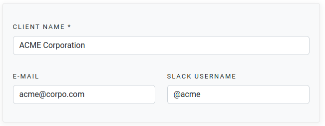
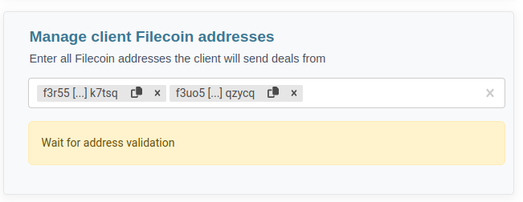
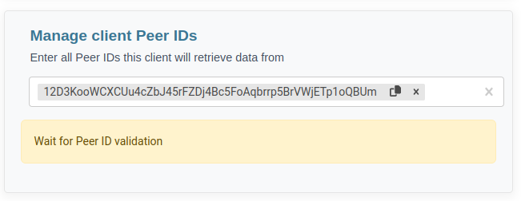
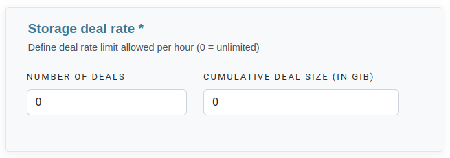
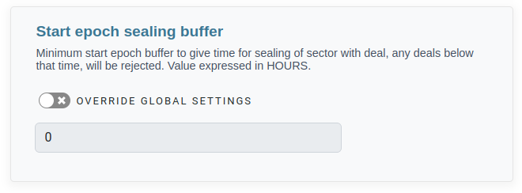

You can conveniently access the navigation options within the sidebar under the `Clients` section. 

At the top of the page, you'll find the option to initiate the creation of a new client by simply clicking on `Create a new client`

### 1. Select a pricing model and storage acceptance logic

The initial step in client creation necessitates the selection of the pricing model and a storage acceptance logic to be associated with them. 


For both the pricing model and acceptance logic, in the absence of user-defined configurations, the system will automatically apply the default settings. 

Consequently, any modifications to the default settings will directly influence the behavior of proposals originating from these clients.


### 2. Fill the identity information

Once the pricing model has been selected, the initial section prompts you to furnish client identification details.

### 3. Manage Filecoin addresses

For the purpose of customer identification when new storage deals are initiated, it is imperative to input all the Filecoin addresses associated with the client.


You have the option to input either the short address (ID address) or the long address. Upon each entry, we will display the counterpart address (the one you didn't enter) for verification and confirmation.



There are no constraints on the quantity of addresses that can be linked to a client.


### 4. Manage client Peer IDs

In order to identify the customer when new retrieval deals are received, it is imperative to provide all the known Peer IDS associated with the client


Please note that for Peer IDs, exclusively the long format (12D format) is supported.



There are no constraints on the quantity of Peer IDs that can be linked to a client.


### 5. Storage deal rate

Irrespective of the globally defined limits for the miner, it is feasible to establish limits that are exclusive to this specific client. 

Once their predefined limits are surpassed, all of the customer's deals will be subject to rejection until a reset is performed.


To establish no limits, simply leave both fields set at 0, signifying unrestricted allowances.


### 6. Start epoch sealing buffer

This client-specific parameter empowers you to stipulate a minimum sector-sealing duration. 
Any deals originating from this client with a duration below this specified minimum will be subject to rejection. 

By default, the miner adheres to its global values, but you have the option to define a distinct value that exclusively applies to this client.


It's important to express this value in hours


