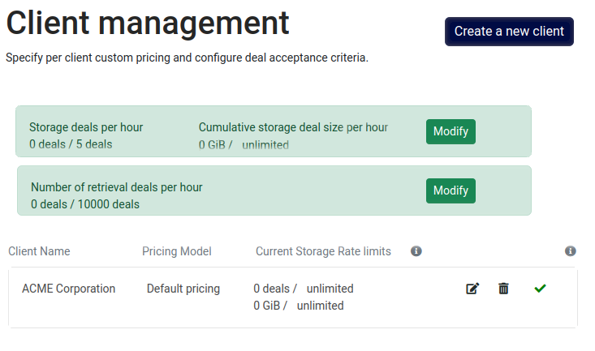

You can access the navigation menu within the sidebar under the `Clients` section.

On this page, you have real-time access to the miner's global limits for both storage and retrieval.

For each customer listed, various options are available:

- **Edit**: You can modify all the information associated with a specific client
- **Delete**: This option allows you to remove a client from the list
- **Block / Release a client**: You can use this feature to either reject all deals originating from a particular client or allow them. This action also permits you to specify a - customized rejection message, which will be communicated to the client in case of deal rejection
