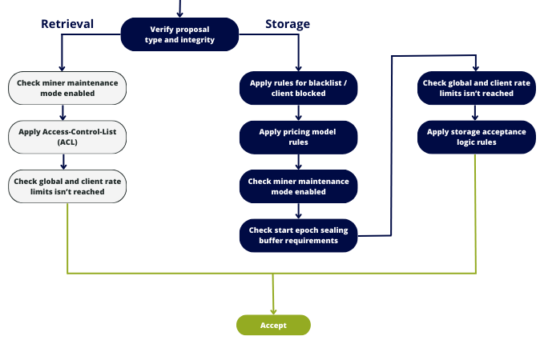

The Deal Filter stands as the central feature within CIDgravity.

This component plays a pivotal role in filtering both incoming (storage) and outgoing (retrieval) deals originating from a miner. 
Its functionality is rooted in the comprehensive configuration set up for this purpose.

- [`Clients`]()
- [`Pricing models`]()
- [`Storage acceptance logics`]()

Its primary responsibility is to analyze all these elements, facilitating a decision on the acceptance or rejection of incoming proposals.

The decision outcome is binary:

- `Accept`: The proposal successfully meets all criteria, allowing for processing by Lotus/Boost.
- `Reject`: The proposal fails to satisfy one or more criteria, leading to rejection. The rejection reason is explicitly specified in the deal filter response.

## How does it works ?

The proposal undergoes a comprehensive analysis through the following steps:

- **Check proposal integrity**: verify the integrity of the incoming proposal.
- **Identify the client**: identify the client associated with the incoming deal.
- **Apply rules for blacklist / client blocked**: implement rules to check if the client is blacklisted or blocked.
- **Apply pricing model rules**: dynamically apply the pricing model corresponding to the client sending the deal.
- **Check maintenance mode**: evaluate whether the miner is currently in maintenance mode.
- **Check sealing buffer requirements**: Verify if the start epoch aligns with the sealing buffer requirements.
- **Check rate limits isn't reached**: Ensure that the client and/or global rate limits have not been exceeded.
- **Apply storage acceptance logic**: dynamically apply the storage acceptance logic defined by the miner.

Upon failure of any of these tests, the proposal is promptly rejected. 
Conversely, if none of the tests fail, the proposal is accepted and progresses for processing by the miner.

In the instance of rejection, a set of error codes may be returned to elucidate the specific reason for the rejection.

- [`You can find the list of error codes on this page`]()


The order holds paramount significance, as the sequential nature of these tests dictates that if a test fails, subsequent steps will not be analyzed.

