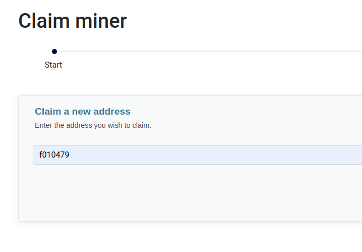
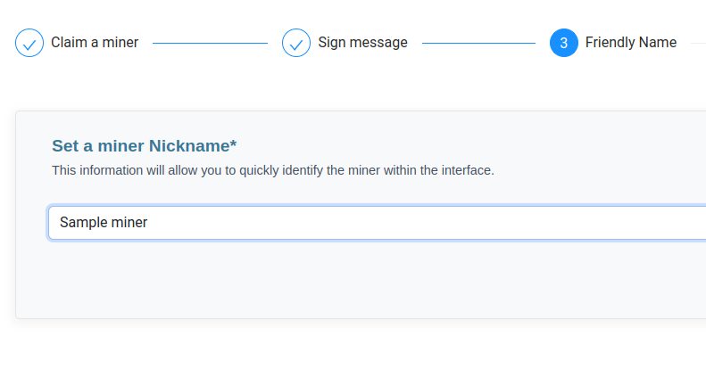
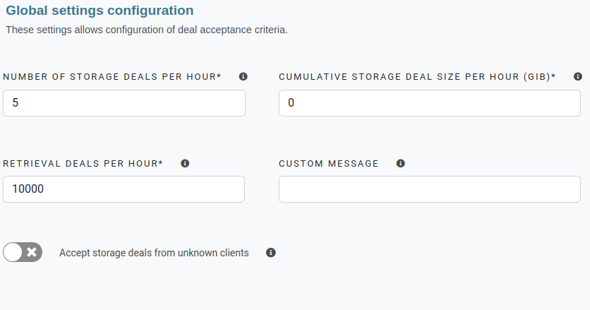

When you first log in to your account, a mini-guide will show you the first steps to take.

You just have to click on the "Next" button to arrive on the step of adding your first miner. Enter the minerID you want to claim on the input field



In the next step, we will ask you to sign a message to prove that you are the owner of the miner. 
The command is pre-filled, you simply need to execute it, it looks like:

```shell
lotus wallet sign [MINER_ADDRESS] [GENERATED_CHALLENGE]
```

## Define a friendly name

If the signature is valid, you will ask to define a friendly name for the miner


Please note, that the friendly name will be the same for all users that claim this miner. If it is modified, it will be for everyone




Once chosen, all you have to do is continue with the Next button


If this miner has already been claimed by you, or someone else, the process stops here with a success message. Otherwise it will continue on the parameters


## Create or import pricing models

If you have another miner on your account, you will be able to directly import their pricing models onto this new miner.

If you want to start from a blank slate, simply choose to create a default pricing model

## Define global limits

Finally, you will be able to customize the miner with different configurations:

- **Number of storage deals per hour**: number of storage deals allowed per hour (accross all clients)
- **Cumulative storage deal size per hour**: cumulative storage deal size allowed per hour (GiB / hour)
- **Retrieval deals per hour**: number of retrieval deals allowed per hour (accross all clients)
- **Custom message**: this message will be sent to the customer when a deal is rejected
- **Accept storage deals from unkown clients**: if a deal arrives with an address of a client who is not among the miner's clients, it will be rejected


We provide some default values for the global limits, you can override this with your custom settings




To finish adding this miner, we will display your token, which you will need to use to configure the connector

You will also be able to launch an end-to-end connectivity test, as soon as your connector is configured by following the different steps proposed here


Don't worry, if you haven't noted your token, you can find it at any time in the Settings menu
