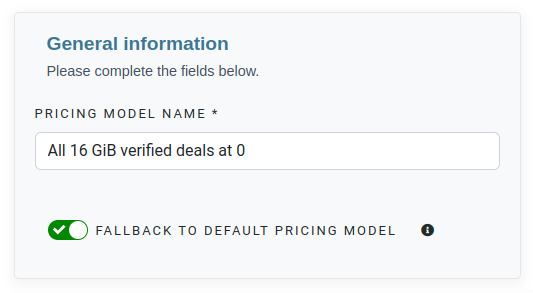
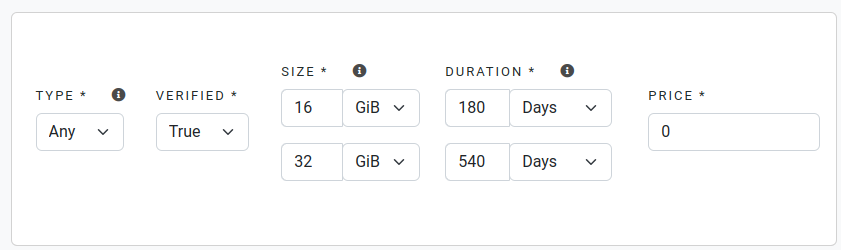

You can use sidebar by selecting the `Storage` tab and further navigating to the `Pricing` section.

At the apex, you have the option to initiate the creation of a new model by clicking on the `Create a new model` button at the top.

### 1. Define a name

For a more granular understanding of the pricing model intricacies, you have the ability to explicitly designate the desired name. 
As an illustration, you can specify a name such as `All 16 GiB verified deals at 0`

### 2. Define the fallback behavior

In the event that the rules of the specified pricing model fail to align with the incoming deal, there exists the capability to automatically enforce the default model.


In the scenario where this option is deactivated, the deal undergoes direct rejection subsequent to the evaluation of the associated pricing model. 
Conversely, with the option enabled, the default model is invoked to facilitate the decision-making process.


### 3. Create the rules

For a model to achieve completeness, it necessitates the incorporation of one or more rules designed to be applicable to incoming proposals.


The sequential traversal of all rules occurs from top to bottom, and careful attention should be paid to their respective order.


In the rule creation process, multiple elements are at your disposal, and their collective evaluation determines whether the rule is a match :

- **Type**: Enables filtering based on the allowed values in the TransferType field.
- **Verified**: Specifies whether this rule accepts verified, unverified, or both types of deals.
- **Size**: Establishes the permissible size range for applying this rule, with the flexibility to define units in various formats.
- **Duration**: Sets the acceptable duration range for applying this rule, providing the option to express it in different units.
- **Price**: Establishes the minimum price prerequisite for a deal that satisfies all the criteria outlined in this rule, with the specification in FIL/GiB/Epoch.


In the evaluation process of a rule, if any single criterion is not met, subsequent criteria will be assessed sequentially.
This sequential evaluation continues until all specified criteria have been examined.


