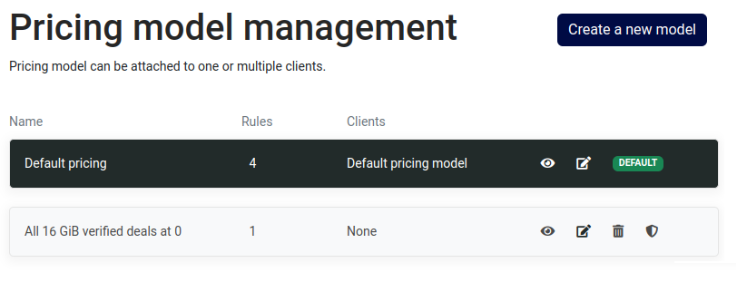

To access the pricing section, you can navigate through the sidebar by selecting `Storage` and then proceeding to `Pricing`.

Each pricing model listed offers several options:

- **View**: Allows you to review all the rules constituting the pricing model
- **Edit**: Permits modification of one or more rules within the model
- **Remove**: Enables deletion of the selected pricing model
- **Set as default**: Establishes the chosen pricing model as the default configuration


The removal of the default pricing model is restricted. 
To delete it, first, designate another model as the default and then proceed with the removal of the desired default model.



The removal of a pricing model linked to a client is constrained. 
Prior to attempting removal, edit the associated client details and ensure that it is not currently in use.

