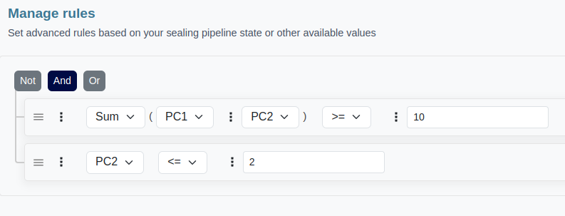

The storage acceptances logic also supports operations between variables, enabling you to combine multiple variables to construct advanced logic that can 
accommodate a wide range of requirements.

## Supported operations

- `Sum`
- `Substraction`
- `Multiplication`
- `Division`


Each operation is limited to a maximum of 2 variables, but you can chain operations together to achieve the desired results. For example, you can create expressions like `VariableA + (VariableB + VariableC)`, which is equivalent to `VariableA + VariableB + VariableC`



To perform operations like VariableA + VariableB - VariableC, you can incorporate both addition and subtraction within the same rule


## How to add an operation to a rule ?

To access advanced operations for storage acceptance logic, you can click on the ellipsis icon (`⋮`) and then select `Advanced operations` from the dropdown menu. 
This will open a menu where you can choose from a range of operations supported by the storage acceptance logic

