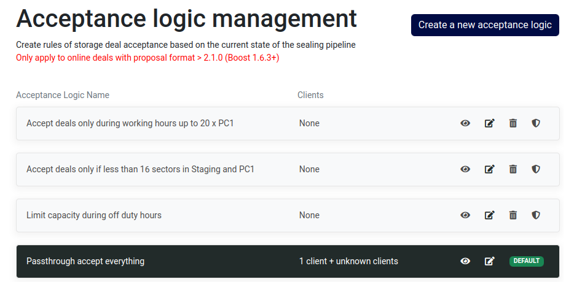

To access the storage acceptance logics section, you can navigate through the sidebar by selecting `Storage` and then proceeding to `Acceptance logic`.

Each acceptance logic listed offers several options:

- **View**: Allows you to review the logic and all associated clients
- **Edit**: Permits modification of the logic that will be applied on incomming deals
- **Remove**: Enables deletion of the selected logic
- **Set as default**: Establishes the chosen acceptance logic as the default configuration


By default, upon claiming a new miner, you will receive 5 sample acceptance logics tailored for various use cases. 

These serve as a source of inspiration, allowing you to either adopt them directly, copy them for further modification, or edit them according to your preferences.
