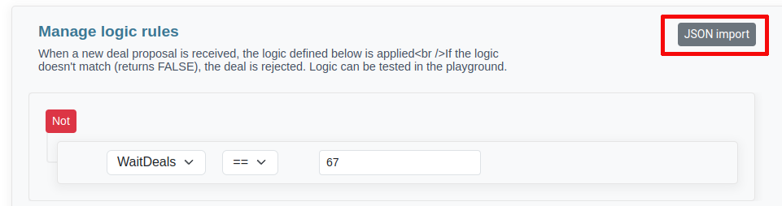
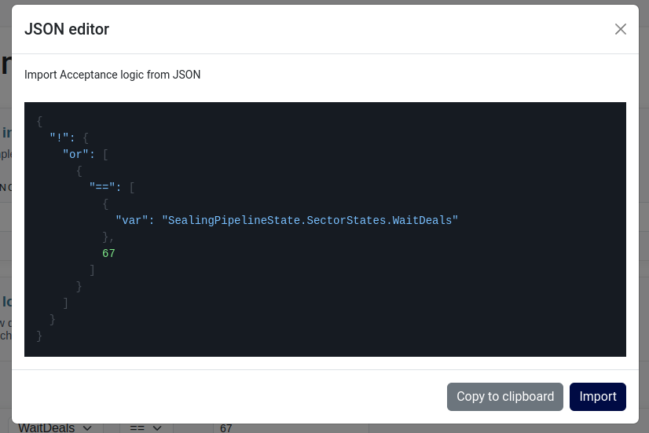

If you are more inclined towards JSON format, we provide the option to modify and import storage acceptance logic in this structure.

To access this feature, while editing a storage acceptance logic, simply utilize the `JSON import` button.

A modal window will be launched, presenting the JSON representation of the storage acceptance logic that is currently loaded in the editor.

You have the ability to directly modify the JSON, copy its contents, insert a new JSON structure, and subsequently update the editor by clicking the `Import` button.


Please exercise caution when using variable names. Failure to adhere to the specified naming conventions may result in import errors
