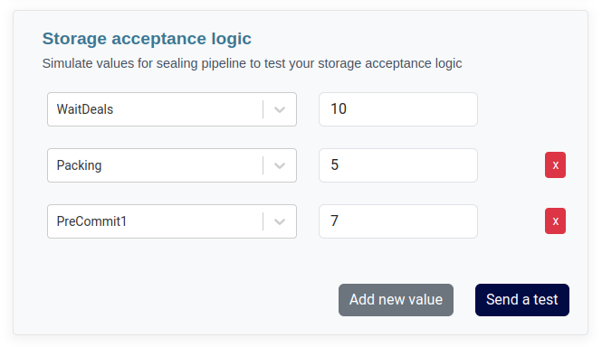

Similar to pricing rules, it is feasible to simulate a storage acceptance logic. 
This simulation capability enables the validation of the logic's accuracy and alignment with the intended filtering criteria before its actual application to incoming deal proposals.

## Fill variables


To perform this validation, navigate to the `Playground`, accessible through the side menu under `Storage`

In the initial block, input all the relevant details specific to the proposal, such as client information, pricing, data size, start epoch, and other pertinent parameters.
In the second block, you have the ability to simulate and configure various values pertaining to the sealing pipeline


There are no restrictions on the number of items that can be added. You can seamlessly include additional items by utilizing the `Add new value` button as needed




## Interpret the result

In the event that your proposal faces rejection as a consequence of the applied storage acceptance logic, the rejection status will be prominently displayed in the results box located on the right-hand side.


All variables are automatically substituted with the actual values used in the simulation, which aids in providing a clear understanding of the specific reasons for the rejection, thus facilitating the debugging and troubleshooting process.


In the case of a storage acceptance logic, which could be conceptualized as something like the following example:

```json
{
   "and":[
      {
         ">=":[
            {
               "var":"PreCommit1"
            },
            10
         ]
      },
      {
         "<=":[
            {
               "var":"PreCommit2"
            },
            2
         ]
      }
   ]
}
```

In the simulation, the outcome would be a failure, and the right-hand screen would display the following result:

```json
{
  "and": [
    {
      ">=": [
        7,
        10
      ]
    },
    {
      "<=": [
        0,
        2
      ]
    }
  ]
}
```

Certainly, the rejection of this proposal is attributed to the discrepancy between the value set in the Playground, which is `PC1 == 7`, 
and the stipulated requirement in the storage acceptance logic, which demands `PC1 >= 10`. 

It's essential to conduct multiple simulations to iteratively refine and establish the most effective logic for your specific use case.