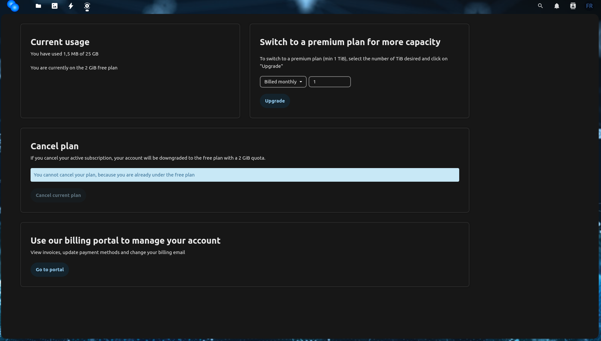
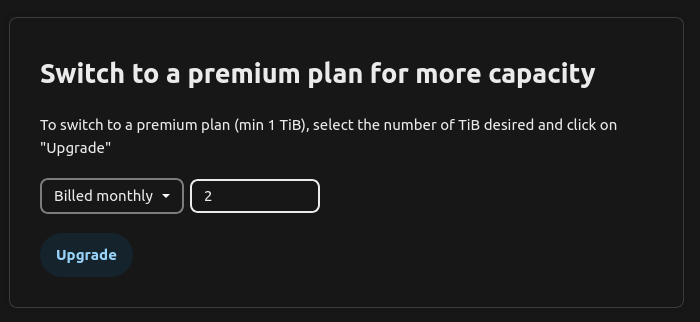
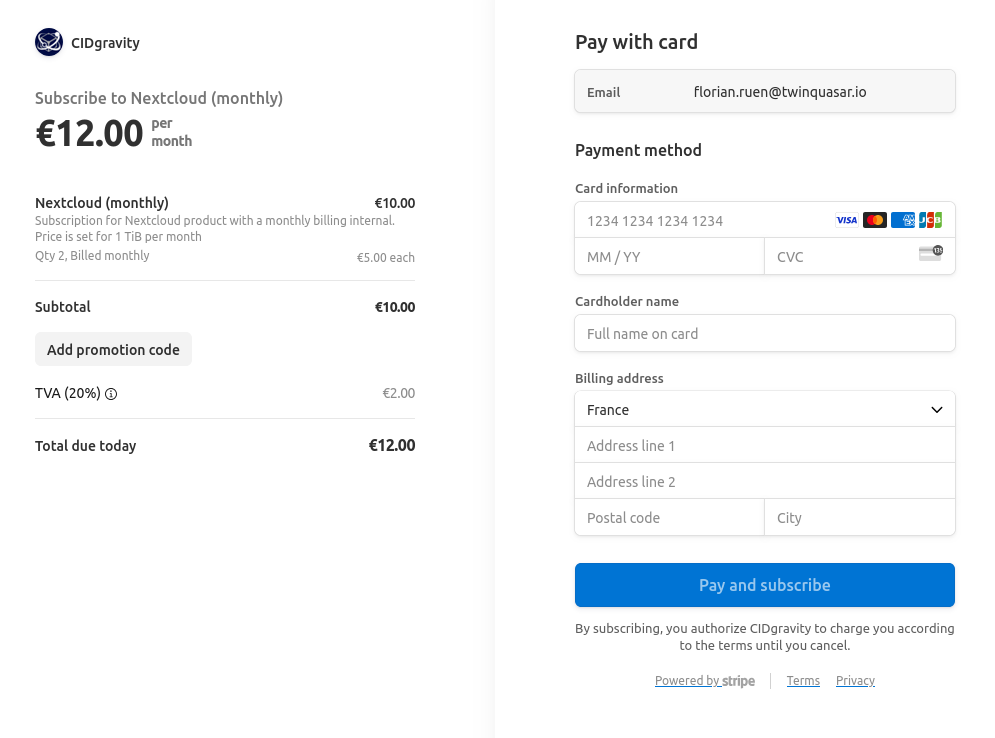

## Go to subscription page

On the top navigation bar, click on **"Subscription"** to navigate to the subscription page.

## Select new capacity

Choose your desired capacity (in **TiB**) and select the billing period (**monthly** or **annually**).
Your account will be billed automatically based on your selection.

Click **"Upgrade"** to continue.

## Payment

You will be redirected to the payment page, where you can:

* Enter your **billing address**
* Provide your **credit card details**

Once all fields are completed, click **"Pay and subscribe"**.

## Capacity available

Once your payment is successfully processed:

* Your subscription is **activated immediately**
* Your new capacity is **available right away**
* You can view the updated capacity in the **bottom left corner** of the screen