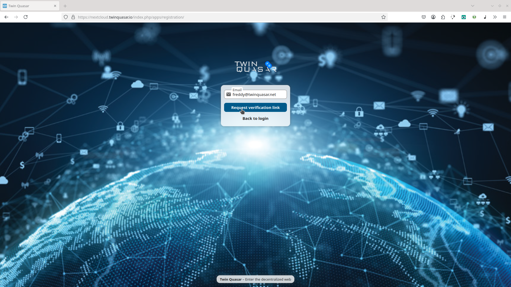
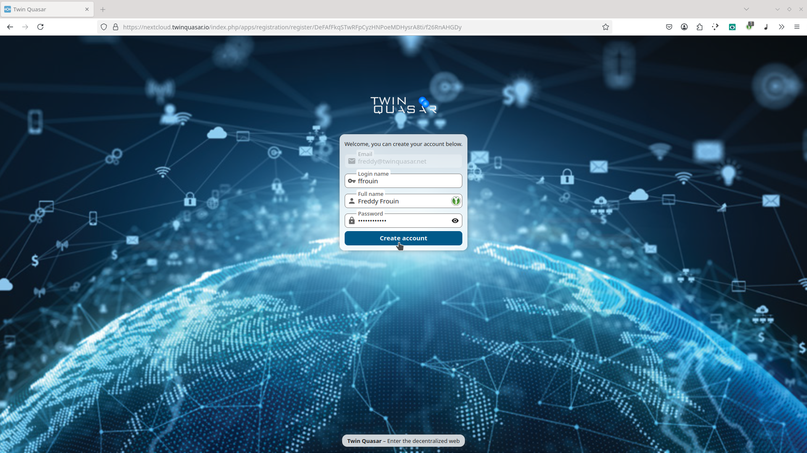

To connect CIDgravity with your own **Nextcloud instance** and start storing files on **IPFS**, you’ll first need to create an account on CIDgravity.


With your account, you get 25 GB of free storage. Need more space? Upgrade easily by [following this simple procedure.]()


### Open the registration page and verify your e-mail address

Start by opening a browser and visiting the following URL [https://nextcloud.twinquasar.io](https://nextcloud.twinquasar.io/index.php/apps/registration/)

Provide your email address to receive a verification code. This email will also be used for account recovery and notifications. 

### Fill account details

Now finish setting up your account by choosing a **username**, **full name**, and a secure **password**.
Click **Create Account** to complete the process and access your Nextcloud instance. 

