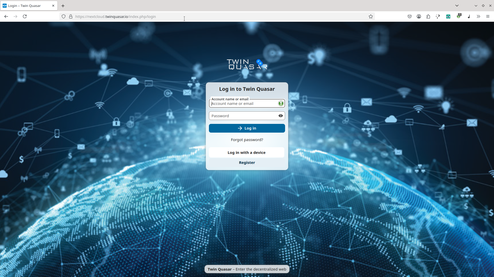
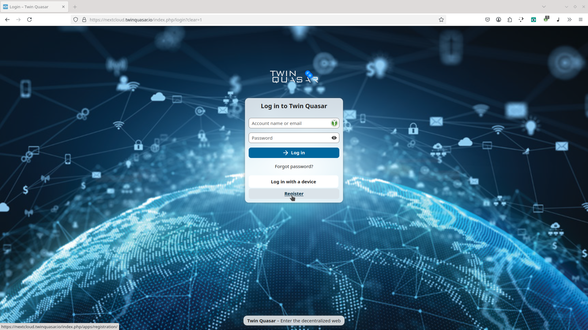
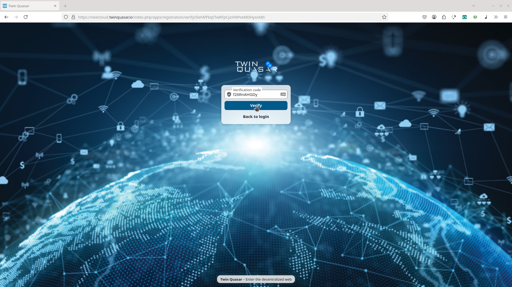

To connect CIDgravity with your own **Nextcloud instance** and start storing files on **IPFS**, you’ll first need to create an account on the Twin Quasar Nextcloud server.

### Open the Registration Page

Start by opening a browser and visiting the following registration URL [https://nextcloud.twinquasar.io](https://nextcloud.twinquasar.io)

This is where you’ll begin the account creation process. 

### Click on **Register**

On the login page, locate and click the **Register** link to begin setting up a new account. 

### Enter Your Email Address

Provide your email address to receive a verification code. This email will also be used for account recovery and notifications. 

### Verify Your Email

Check your inbox for the code, then return to the page to enter it. Click **Verify** to continue.
This step ensures your email is valid and accessible. 

### Complete the Registration

Now finish setting up your account by choosing a **username**, **full name**, and a secure **password**.
Click **Create Account** to complete the process and access your Nextcloud instance. 

