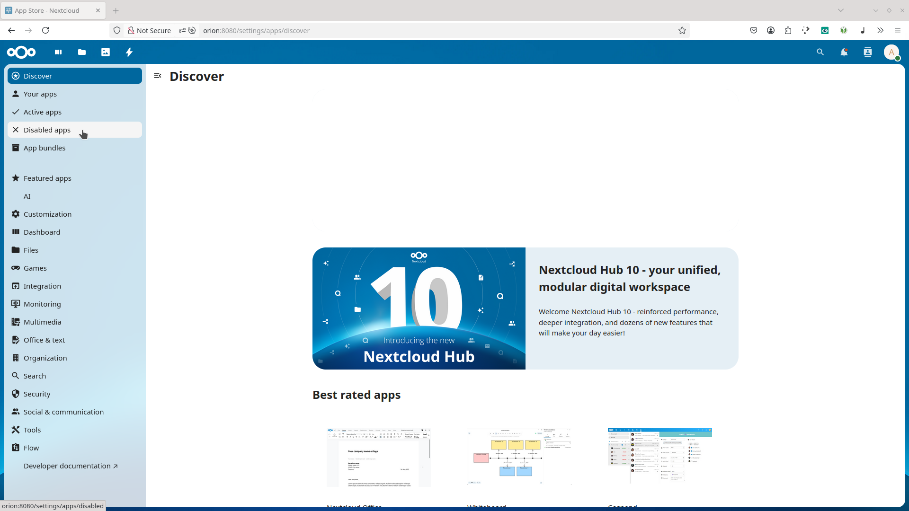

### Create an admin account

Start by setting up your admin credentials. Choose a secure username and password, then click **Install** to complete the initial setup of your Nextcloud server. 

### Skip recommended apps

Nextcloud will suggest installing additional apps. These are optional and not required for CIDgravity, so you can safely click **Skip** to proceed. 

### Open the apps Menu

After setup, access the list of available apps by clicking the **grid icon** at the top right of the dashboard. 

### Go to disabled apps

On the left-hand side, select **Disabled apps** to find core features that are not yet active in your installation. 

### Enable external storage support

Locate the **External Storage Support** app and click **Enable**. This app is essential for integrating external file systems like IPFS. 

### Search for CIDgravity

Use the **search bar** in the top right to look for the CIDgravity app. This step helps you quickly locate the integration needed for IPFS support. 

### Install CIDgravity

Once you've found **CIDgravity – IPFS/Filecoin External Storage**, click **Download and Enable** to install it on your Nextcloud instance. 

### Open administration settings

To configure the new storage, open the **Administration Settings** by clicking your user icon in the top-right menu and selecting **Settings**. 

### Go to external storage

In the settings sidebar, find the **External Storage** section under **Administration** to set up your IPFS backend. 

### Add Your IPFS storage details

Create a new storage entry by entering a folder name (e.g., `IPFS Vault`), and provide your credentials from [https://nextcloud.twinquasar.io](https://nextcloud.twinquasar.io). You can also check **All users** if you want others to access it.

Click the ✅ checkmark to save the configuration. 

### Confirm with your password

For security reasons, Nextcloud will ask you to confirm your admin password before applying any changes to the storage configuration. 

### Check for the green mark

If everything is correctly configured, you’ll see a green checkmark or arrow next to the storage entry. This confirms the IPFS storage is active and accessible. 

