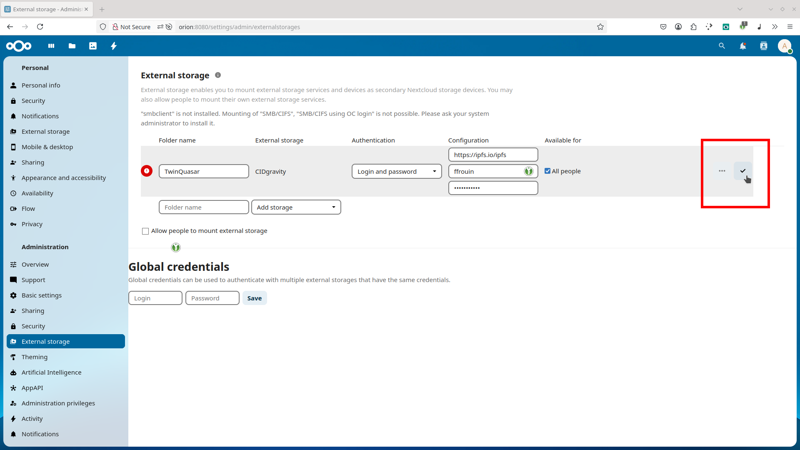

## Enable external storage support

This is a mandatory component required for the CIDgravity app to work properly.

Go on the available apps page by clicking the **grid icon** at the top right of the dashboard. 

  

On the left-hand side, select **Disabled apps** to find core features that are not yet active in your installation. 

  

Locate the **External Storage Support** app and click **Enable**. 

  

## Enable the CIDgravity app

The app can be directly installed from the Nextcloud app store.

Use the **search bar** in the top right to look for the CIDgravity app. This step helps you quickly locate the integration needed for IPFS support. 

  

Once you've found **CIDgravity – IPFS/Filecoin External Storage**, click **Download and Enable** to install it on your Nextcloud instance. 

## Connect the CIDgravity app

To configure the new storage, open the **Administration Settings** by clicking your user icon in the top-right menu and selecting **Settings**. 

  

In the sidebar, find the **External Storage** section under **Administration** to set up your IPFS backend. 

  

Create a new storage entry by entering a folder name (e.g., `IPFS Vault`), and provide your credentials from [https://nextcloud.twinquasar.io](https://nextcloud.twinquasar.io). You can also check **All users** if you want others to access it.

Click the ✅ checkmark to save the configuration. 

  

For security reasons, Nextcloud will ask you to confirm your admin password before applying any changes to the storage configuration. 

  

If everything is correctly configured, you’ll see a green checkmark or arrow next to the storage entry. This confirms the IPFS storage is active and accessible. 

