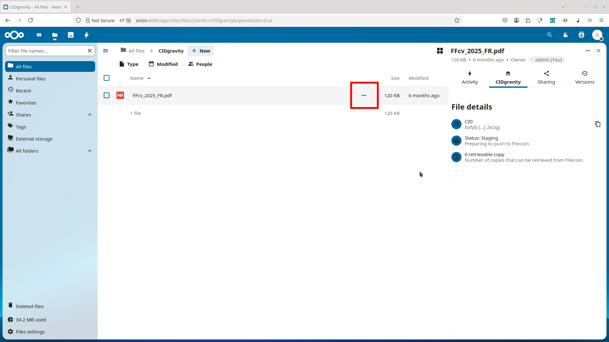

At that point, you have a new folder on your user account called `IPFS Vault`. You can simply drop and read files are usual. All the files are automatically send and stored on Filecoin


The files are stored as is on Filecoin. You need to encrypt any sensitive data!


## Open file details
Once your file is uploaded, click the **three dots (⋯)** next to the file name and select **Open details**. 

This will open a sidebar with additional metadata. 


<br /><br />

### Retrieve files directly on IPFS

Your data is safely replicated across the **IPFS/Filecoin network** — even if CIDgravity becomes unavailable, your content remains accessible via its **Content Identifier (CID)**.

To access your file from an public IPFS gateway:

1. Copy the **CID** from the file details panel.
2. Use it with any public IPFS gateway by replacing `<CID>` in the following URL:

```
https://gateway.pinata.cloud/ipfs/<CID>
```




## Access file metadata

In the details panel, you’ll see IPFS-related metadata including:

* **CID**: The Content Identifier for the uploaded file
* **Status**: Whether the file is uploaded, pinned, or in progress
* **Replication progress**: Tracks how many IPFS/Filecoin replicas exist


Note: It may take up to 24 hours for your data to become fully available on the Filecoin network.


This confirms your file has been successfully added to the IPFS network. 


