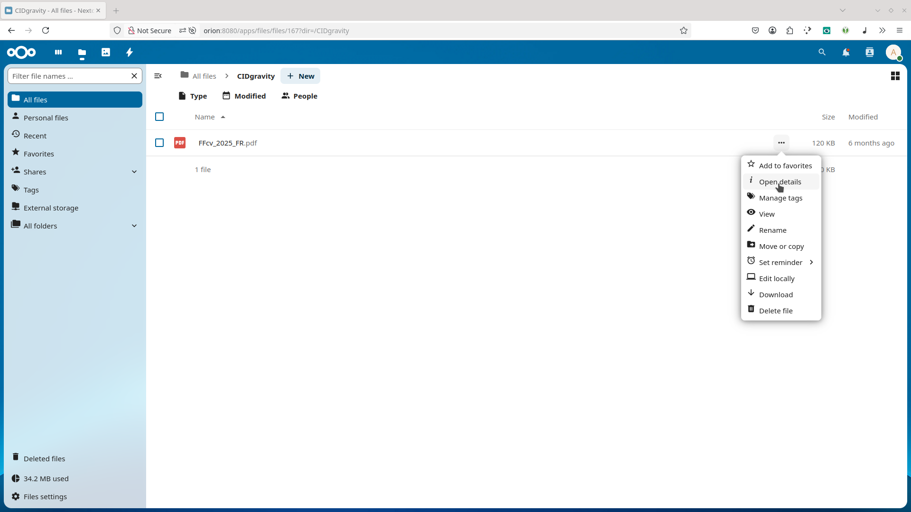

Once your CIDgravity storage is set up in Nextcloud, you can easily upload files and view their IPFS metadata. 

Here’s how to get started.

### Open the Files Menu

From the main dashboard, click the **Files** icon in the top-left corner. This will open your file manager in Nextcloud. 

### Enter the CIDgravity Folder

Locate and click the folder name you created earlier when configuring external storage (e.g., `IPFS Storage`). 

This is where files will be stored and pinned to IPFS. 

### Upload a File

To upload a file, click the **+ New** button and choose **Upload file** from the dropdown. Select any file from your device to begin the upload. 

### Open File Details

Once your file is uploaded, click the **three dots (⋯)** next to the file name and select **Open details**. This will open a sidebar with additional metadata. 

### View CIDgravity Metadata

In the details panel, you’ll see IPFS-related metadata including:

* **CID**: The Content Identifier for the uploaded file
* **Status**: Whether the file is uploaded, pinned, or in progress
* **Replication progress**: Tracks how many IPFS/Filecoin replicas exist

This confirms your file has been successfully added to the IPFS network. 

