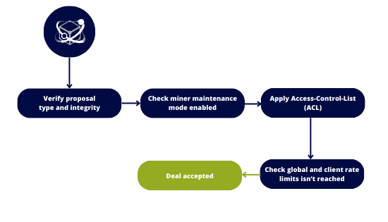

This component plays a pivotal role in filtering retrieval deals using the `Clients` registered in CIDgravity

The decision outcome is binary:

- `Accept`: The proposal successfully meets all criteria, allowing for processing by Lotus/Boost.
- `Reject`: The proposal fails to satisfy one or more criteria, leading to rejection. The rejection reason is explicitly specified in the response.

## How does it works ?

The proposal undergoes a comprehensive analysis through the following steps:

- **Proposal integrity**: verify the integrity of the incoming proposal
- **Client identification**: identify the client associated with the incoming deal
- **Maintenance mode**: evaluate whether the miner is currently in maintenance mode
- **Deny list**: Verify if the client peer id is blacklisted / not whitelisted
- **Rate limits**: Ensure that the client and/or global retrieval rate limits have not been exceeded

Upon failure of any of these tests, the proposal is promptly rejected. 
Conversely, if none of the tests fail, the proposal is accepted and progresses for processing by the miner.

In the instance of rejection, a set of error codes may be returned to elucidate the specific reason for the rejection.


The order is important because if a test fails, subsequent steps will not be analyzed.
