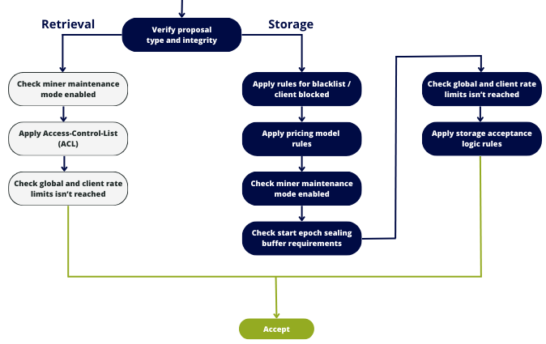

The Deal Filter stands as the central feature within CIDgravity.

This component plays a pivotal role in filtering both incoming (storage) and outgoing (retrieval) deals originating from a miner. 
Its functionality is rooted in the comprehensive configuration set up for this purpose.

- `Clients`
- `Pricing models`
- `Storage acceptance logics`

Its primary responsibility is to analyze all these elements, facilitating a decision on the acceptance or rejection of incoming proposals.

The decision outcome is binary:

- `Accept`: The proposal successfully meets all criteria, allowing for processing by Lotus/Boost.
- `Reject`: The proposal fails to satisfy one or more criteria, leading to rejection. The rejection reason is explicitly specified in the deal filter response.

## How does it works ?

The proposal undergoes a comprehensive analysis through the following steps:

- **Proposal integrity**: verify the integrity of the incoming proposal
- **Client identification**: identify the client associated with the incoming deal
- **Blacklist / client blocked**: check if the client is blacklisted or blocked
- **Pricing model**: dynamically apply the pricing model corresponding to the client
- **Maintenance mode**: evaluate whether the miner is currently in maintenance mode
- **Start epoch sealing buffer**: Verify if the start epoch aligns with the requirements
- **Rate limits**: Ensure that the client and/or global rate limits have not been exceeded
- **Storage acceptance logic**: dynamically apply the storage acceptance logic defined

Upon failure of any of these tests, the proposal is promptly rejected. 
Conversely, if none of the tests fail, the proposal is accepted and progresses for processing by the miner.

In the instance of rejection, a set of error codes may be returned to elucidate the specific reason for the rejection.


The order holds paramount significance, as the sequential nature of these tests dictates that if a test fails, subsequent steps will not be analyzed.
