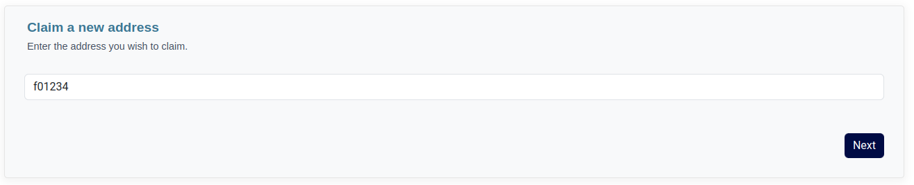
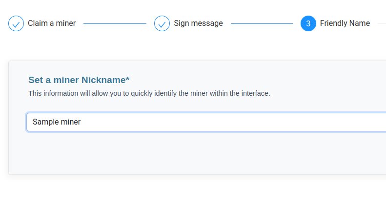
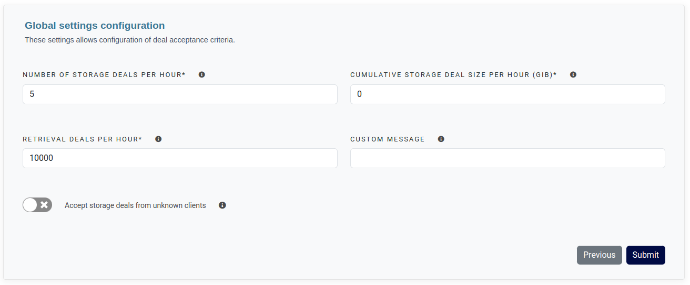

Upon your initial account login, you will be presented with a concise instructional guide.

Simply clicking the `Next` button will advance you to the stage to claim a miner. 

## Fill the miner ID

You can input the desired minerID into the provided field to initiate the claim process.



In the subsequent stage, you will need to provide a signature for verifying the miner ownership. 
The command is pre-populated with all required information as follows:

```shell
lotus wallet sign [MINER_ADDRESS] [GENERATED_CHALLENGE]
```

## Define a friendly name

When the signature has been verified, you will be prompted to set a friendly name for the miner.


It's crucial to bear in mind that the designated friendly name will remain consistent across all users who claim this miner. 
Any alterations to this name will be applied to everyone utilizing it.




Once your selection is made, the subsequent step involves simply by clicking the `Next` button.


In the event that the miner has previously been claimed, either by you or another user, the process will terminate at this step. 
Conversely, if the miner remains unclaimed, the procedure will persist, moving forward to the settings.


## Import or start from scratch

In the presence of additional miners within your account, you will have the option to seamlessly import their pricing models and acceptance logics onto the new miner.

However, if you prefer to initiate it from scratch, you can opt to generate a default pricing model and sample acceptance logics.

## Set settings and limits

In the final phase, you gain the capability to fine-tune the miner's settings through various configurations:

- **Number of storage deals per hour**: Specifies the maximum allowable number of storage deals within a given hour, across all clients.
- **Cumulative storage deal size per hour**: Dictates the cumulative storage deal capacity allotted per hour, measured in Gigabytes (GiB) per hour.
- **Retrieval deals per hour**: Sets the maximum count of retrieval deals sanctioned within a single hour, encompassing all clients.
- **Custom message**: Provides the opportunity to craft a personalized message that will be transmitted to the customer in the event of a deal rejection.
- **Accept storage deals from unknown clients**: Enables or disables the reception of storage deals from clients not previously registered. If enabled, such deals will be rejected, ensuring that only recognized clients can initiate storage transactions.



To complete the process of adding this miner, we will present your unique token, which is essential for configuring the connector.

Additionally, you will have the option to initiate an end-to-end connectivity test once the connector is configured.


Rest assured, in case you didn't save the token, you can retrieve it at any time within the Settings menu.

