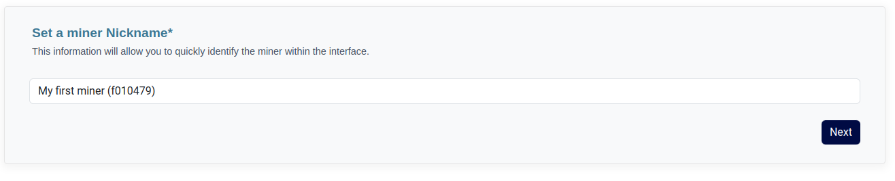

Upon your initial account login, you will be presented with a concise instructional guide, offering guidance on the initial actions to undertake.

Simply clicking the "Next" button will advance you to the stage to claim a miner. At this juncture, input the desired minerID into the provided field to initiate the claim process.


In the subsequent stage, you will be prompted to provide a signature as a means of verifying the miner ownership. The command required for this purpose is conveniently pre-populated, necessitating only its execution. The command format is as follows:

```shell
lotus wallet sign [MINER_ADDRESS] [GENERATED_CHALLENGE]
```

## Define a friendly name

Should the signature prove valid, you will be prompted to designate a friendly name for the miner.


It's crucial to bear in mind that the designated friendly name will remain consistent across all users who claim ownership of this particular miner. 
Any alterations to this name will be universally applied to everyone utilizing it.




Once your selection is made, the subsequent step involves simply proceeding by clicking the "Next" button.


In the event that the miner has previously been claimed, either by you or another user, the process will terminate at this point, accompanied by a success notification. 
Conversely, if the miner remains unclaimed, the procedure will persist, moving forward to address the settings.


## Create or import pricing models

In the presence of additional miners within your account, you will have the option to seamlessly import their existing pricing models onto the new miner.

However, if you prefer to initiate the pricing model from scratch, you can opt to generate a default pricing model, commencing with a clean slate.

## Define global limits

In the final phase, you gain the capability to fine-tune the miner's settings through various configurations:

- **Number of storage deals per hour**: Specifies the maximum allowable number of storage deals within a given hour, across all clients.
- **Cumulative storage deal size per hour**: Dictates the cumulative storage deal capacity allotted per hour, measured in Gigabytes (GiB) per hour.
- **Retrieval deals per hour**: Sets the maximum count of retrieval deals sanctioned within a single hour, encompassing all clients.
- **Custom message**: Provides the opportunity to craft a personalized message that will be transmitted to the customer in the event of a deal rejection.
- **Accept storage deals from unknown clients**: Enables or disables the reception of storage deals from clients not previously registered. If enabled, such deals will be rejected, ensuring that only recognized clients can initiate storage transactions.


We offer predefined default values for the global limits; however, you have the flexibility to supersede these defaults by configuring your own customized settings.



To complete the process of adding this miner, we will present your unique token, which is essential for configuring the connector.

Additionally, you will have the option to initiate an end-to-end connectivity test once the connector is configured. You can follow the provided steps to ensure seamless integration and functionality.


Rest assured, in case you didn't save the token, you can retrieve it at any time within the Settings menu.

