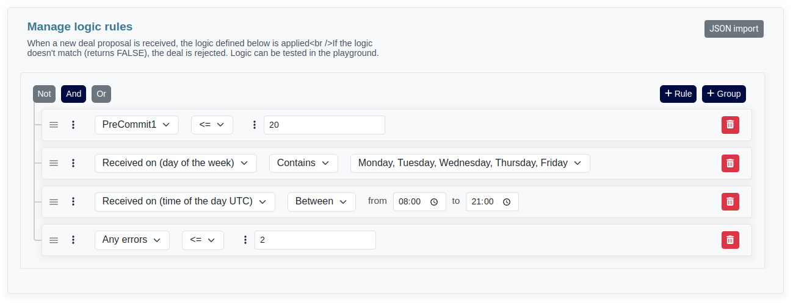
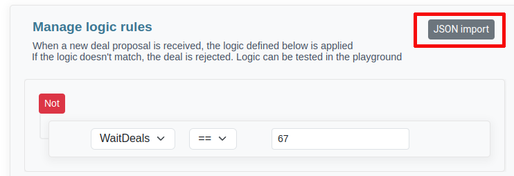
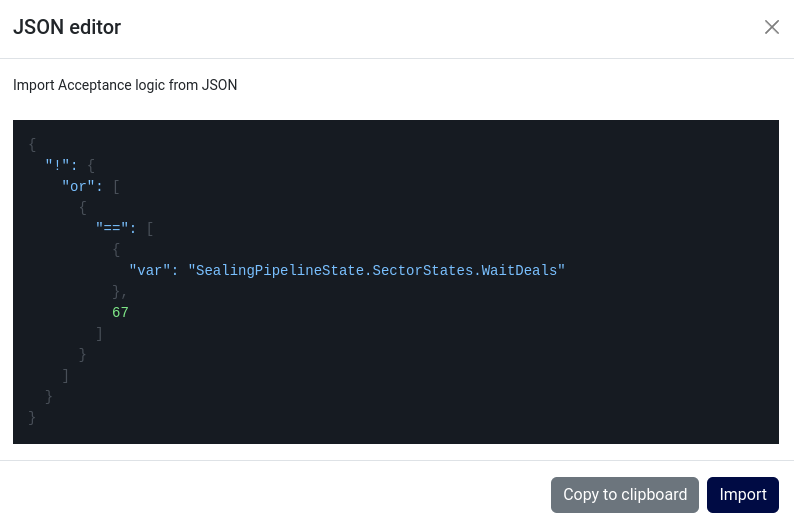
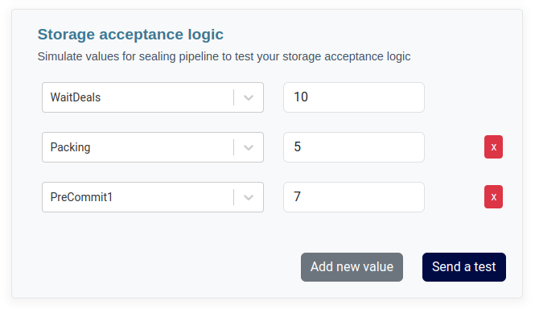
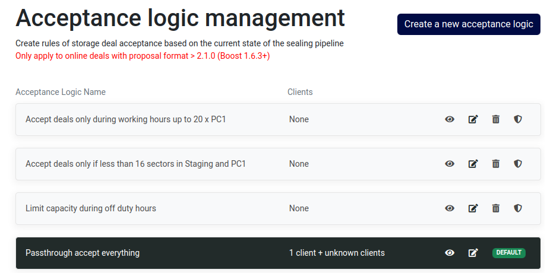

To access this module, you can navigate through the sidebar menu by selecting `Storage` and then `Acceptance logic`


This feature will exclusively works for online deals and requires the miner to be configured to utilize Boost node with a version equal or greater than 2.1.0


## What is a storage acceptance logic ?

This entails the establishment of a rule-based system for the determination of transaction approval or rejection, contingent on a diverse criterias, which encompasses:

- Sealing Pipeline State
- Temporal factors, encompassing both the time of day and daytime considerations.
- FIL price (to be introduced in the near future)
- Disk Space Availability (to be introduced in the near future)
- Concurrent Download Thresholds (to be introduced in the near future)

Furthermore, it is imperative to underline that a storage acceptance algorithm is concurrently applied alongside the pricing model.

The storage acceptance logic accommodates the following parameters:
- Variables
- Values
- Advanced operations
- Comparison signs

## How does it works ?

When crafting a storage acceptance logic within CIDgravity, a JSON-formatted logic is generated and subsequently applied upon the arrival of a proposal. 

Here is an illustrative example of an applied JSON logic:

```json
{
   "or":[
      {
         ">=":[
            {
               "var":"PreCommit1"
            },
            10
         ]
      },
      {
         "<=":[
            {
               "var":"PreCommit2"
            },
            2
         ]
      }
   ]
}
```

## Available values

When crafting new storage acceptance logic, you are presented with a variety of variables that you can use. These variables can be combined to formulate more advanced and sophisticated acceptance criteria. 

By leveraging the available variables and operations, you can design intricate and highly customized logic to govern how storage deals are accepted or rejected

#### Sealing pipeline - sector states

These variables correspond to the states within the sealing pipeline, excluding errors or failed states


The unit of measurement for sealing pipeline variables is typically a deal number, represented as an integer.


| Value | Description
| --- | --- | --- |
| WaitDeals | waiting for more pieces (deals) to be added to the sector
| Packing | sector not in sealStore, and not on chain
| AddPiece | put deal data (and padding if required) into the sector
| GetTicket | generate ticket
| PreCommit1 | do PreCommit1
| PreCommit2 | do PreCommit2
| PreCommitting | on chain pre-commit (deprecated)
| PreCommitWait | waiting for precommit to land on chain
| SubmitPreCommitBatch | /
| PreCommitBatchWait | /
| WaitSeed | waiting for seed
| Committing | compute PoRep
| CommitFinalize | cleanup sector metadata before submitting the proof (early finalize)
| SubmitCommit | send commit message to the chain
| SubmitCommitAggregate | /
| CommitAggregateWait | /
| FinalizeSector | /
| Proving | /
| Available | proving CC available for SnapDeals
| FailedUnrecoverable | /
| DealsExpired | /
| RecoverDealIDs | /
| Faulty | sector is corrupted or gone for some reason
| FaultReported | sector has been declared as a fault on chain
| FaultedFinal | fault declared on chain
| Terminating | /
| TerminateWait | /
| TerminateFinality | /
| Removing | /
| Removed | /
| SnapDealsWaitDeals | snap deals / cc update
| SnapDealsAddPiece | snap deals / cc update
| SnapDealsPacking | snap deals / cc update
| UpdateReplica | snap deals / cc update
| ProveReplicaUpdate | snap deals / cc update
| SubmitReplicaUpdate | snap deals / cc update
| WaitMutable | snap deals / cc update
| ReplicaUpdateWait | snap deals / cc update
| UpdateActivating | snap deals / cc update
| ReleaseSectorKey | snap deals / cc update
| FinalizeReplicaUpdate | snap deals / cc update
| SnapDealsDealsExpired | /
| SnapDealsRecoverDealIDs | /
| AbortUpgrade | /
| ReceiveSector | for external import

#### Sealing pipeline - sector states errors

These variables correspond to the errors and failed states


You can use the "Any error", if you want to create an acceptance logic for any failed sector state, avoiding complex operations


| Value | Description
| --- | --- | --- |
| Any error | Sum of all sector states in error
| AddPieceFailed | /
| CommitFinalizeFailed | /
| SealPreCommit1Failed | /
| SealPreCommit2Failed | /
| PreCommitFailed | /
| ComputeProofFailed | /
| RemoteCommitFailed | /
| CommitFailed | /
| PackingFailed | /
| FinalizeFailed | /
| TerminateFailed | /
| RemoveFailed | /
| SnapDealsAddPieceFailed | /
| ReplicaUpdateFailed | /
| ReleaseSectorKeyFailed | /
| FinalizeReplicaUpdateFailed | /

#### Other variables

In addition to the variables related to the sealing pipeline, we also offers variables that are calculated at the moment when a proposal is received. 
These dynamic variables can be incorporated into each stages of an storage acceptance logic

| Value | Description | Unit
| --- | --- | --- |
| ReceivedOnTimeOfDayUTC | datetime utc at which the proposal is analyzed | Datetime
| ReceivedOnDayOfWeek | day of the week at which the proposal is analysed | Day of week


It's noteworthy that additional variables may become available in future versions of CIDgravity


## Comparison signs

In the acceptance logics storages, you can perform different operations. You can then add comparison signs

It is all of these two elements that define an acceptance rule.

Within the storage acceptance logics, various operations can be executed, allowing for the incorporation of comparison operators.

These two constituents collectively constitute the foundation of an acceptance rule.

#### Supported signs

- `==`
- `<=`
- `>=`
- `>`
- `<`
- `!=`
- `Between`
- `Not between`
- `Is null`
- `Is not null`


With the utilization of these comparison operators, you have the capability to compare values, variables (e.g., VariableA < VariableB), or even operations (e.g., VariableA + VariableB !== VariableC)


## Advanced operations

The storage acceptances logic also supports operations between variables, enabling you to combine multiple variables to construct advanced logic that can 
accommodate a wide range of requirements.

#### Supported operations

- `Sum`
- `Substraction`
- `Multiplication`
- `Division`


Each operation is limited to a maximum of 2 variables, but you can chain operations together to achieve the desired results. For example, you can create expressions like `VariableA + (VariableB + VariableC)`, which is equivalent to `VariableA + VariableB + VariableC`



To perform operations like VariableA + VariableB - VariableC, you can incorporate both addition and subtraction within the same rule


#### How to add an operation to a rule ?

To access advanced operations for storage acceptance logic, you can click on the ellipsis icon (`⋮`) and then select `Advanced operations` from the dropdown menu. 

This will open a menu where you can choose from a range of operations supported by the storage acceptance logic



## Manual import JSON

If you are more inclined towards JSON format, we provide the option to modify and import storage acceptance logic in this structure.

To access this feature, while editing a storage acceptance logic, simply utilize the `JSON import` button.



A modal window will be launched, presenting the JSON representation of the storage acceptance logic that is currently loaded in the editor.



You have the ability to directly modify the JSON, copy its contents, insert a new JSON structure, and subsequently update the editor by clicking the `Import` button.


Please exercise caution when using variable names. Failure to adhere to the specified naming conventions may result in import errors


## Test logic in playground

Similar to pricing rules, it is feasible to simulate a storage acceptance logic. 
This simulation capability enables the validation of the logic's accuracy and alignment with the intended filtering criteria before its actual application to incoming deal proposals.

#### Fill variables

To perform this validation, navigate to the `Playground`, accessible through the side menu under `Storage`

In the initial block, input all the relevant details specific to the proposal, such as client information, pricing, data size, start epoch, and other pertinent parameters.
In the second block, you have the ability to simulate and configure various values pertaining to the sealing pipeline


There are no restrictions on the number of items that can be added. You can seamlessly include additional items by utilizing the `Add new value` button as needed




#### Interpret the result

In the event that your proposal faces rejection as a consequence of the applied storage acceptance logic, the rejection status will be prominently displayed in the results box located on the right-hand side.


All variables are automatically substituted with the actual values used in the simulation, which aids in providing a clear understanding of the specific reasons for the rejection, thus facilitating the debugging and troubleshooting process.


In the case of a storage acceptance logic, which could be conceptualized as something like the following example:

```json
{
   "and":[
      {
         ">=":[
            {
               "var":"PreCommit1"
            },
            10
         ]
      },
      {
         "<=":[
            {
               "var":"PreCommit2"
            },
            2
         ]
      }
   ]
}
```

In the simulation, the outcome would be a failure, and the right-hand screen would display the following result:

```json
{
  "and": [
    {
      ">=": [
        7,
        10
      ]
    },
    {
      "<=": [
        0,
        2
      ]
    }
  ]
}
```

Certainly, the rejection of this proposal is attributed to the discrepancy between the value set in the Playground, which is `PC1 == 7`, 
and the stipulated requirement in the storage acceptance logic, which demands `PC1 >= 10`. 

It's essential to conduct multiple simulations to iteratively refine and establish the most effective logic for your specific use case.

## Manage all storage acceptance logics

To access the storage acceptance logics section, you can navigate through the sidebar by selecting `Storage` and then proceeding to `Acceptance logic`.



Each acceptance logic listed offers several options:

- **View**: Allows you to review the logic and all associated clients
- **Edit**: Permits modification of the logic that will be applied on incomming deals
- **Remove**: Enables deletion of the selected logic
- **Set as default**: Establishes the chosen acceptance logic as the default configuration


By default, upon claiming a new miner, you will receive 5 sample acceptance logics tailored for various use cases. 

These serve as a source of inspiration, allowing you to either adopt them directly, copy them for further modification, or edit them according to your preferences.
