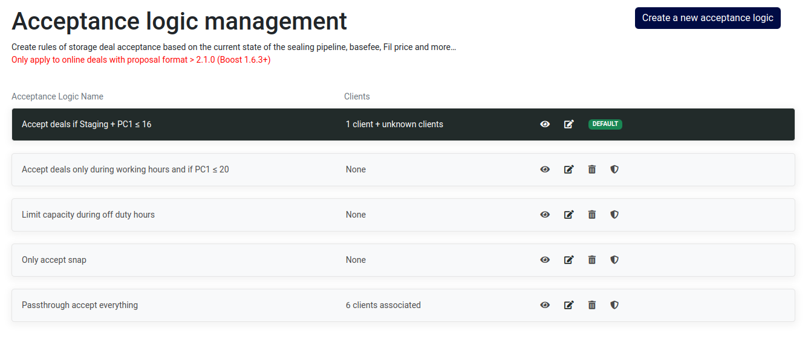

To access this module, you can navigate through the sidebar menu by selecting `Storage` and then `Acceptance logic`


This feature will exclusively works for ONLINE deals and requires the miner to be configured with Boost >= 2.1.0


## Definition

A storage acceptance logic is a rule-based system for the determination of transaction approval or rejection, based on diverse criterias, such as:

- Sealing Pipeline State
- Temporal factors, like the time of day or day of the wee
- FIL price (to be introduced in the near future)
- Concurrent Download Thresholds (to be introduced in the near future)

Furthermore, it is imperative to underline that a storage acceptance algorithm is concurrently applied alongside the pricing model.

The storage acceptance logic accommodates the following parameters:
- `Variables`
- `Values`
- `Advanced operations`
- `Comparison signs`

## How does it works ?

When crafting a storage acceptance logic within CIDgravity, a JSON-formatted logic is generated and applied upon the arrival of a proposal. 

Here is an illustrative example of an applied JSON logic:

```json
{
   "or":[
      {
         ">=":[
            {
               "var":"PreCommit1"
            },
            10
         ]
      },
      {
         "<=":[
            {
               "var":"PreCommit2"
            },
            2
         ]
      }
   ]
}
```

## Manage existing logics

To manage all existing acceptance logic, you can navigate through the sidebar by selecting `Storage` and then `Acceptance logic`.



Each acceptance logic listed offers several options:

- **View**: Allows you to review the logic and all associated clients
- **Edit**: Permits modification of the logic that will be applied on incomming deals
- **Remove**: Enables deletion of the selected logic
- **Set as default**: Establishes the chosen acceptance logic as the default configuration


By default, upon claiming a new miner, you will receive 5 sample acceptance logics tailored for various use cases. 

These serve as a source of inspiration, allowing you to either use them directly, or edit them according to your preferences.


## Create new logic

### Available values

When crafting new storage acceptance logic, you are presented with a variety of variables that you can use. These variables can be combined to formulate more advanced acceptance criteria. 

By leveraging the variables and operations, you can design highly customized logic to define how storage deals are accepted or rejected

#### Sealing pipeline - sector states

These variables correspond to the states within the sealing pipeline, excluding errors or failed states


This variables are express as a number of deal, represented as an integer.


| Value | Description
| --- | --- | --- |
| WaitDeals | waiting for more pieces (deals) to be added to the sector
| Packing | sector not in sealStore, and not on chain
| AddPiece | put deal data (and padding if required) into the sector
| GetTicket | generate ticket
| PreCommit1 | do PreCommit1
| PreCommit2 | do PreCommit2
| PreCommitting | on chain pre-commit (deprecated)
| PreCommitWait | waiting for precommit to land on chain
| SubmitPreCommitBatch | /
| PreCommitBatchWait | /
| WaitSeed | waiting for seed
| Committing | compute PoRep
| CommitFinalize | cleanup sector metadata before submitting the proof (early finalize)
| SubmitCommit | send commit message to the chain
| SubmitCommitAggregate | /
| CommitAggregateWait | /
| FinalizeSector | /
| Proving | /
| Available | proving CC available for SnapDeals
| FailedUnrecoverable | /
| DealsExpired | /
| RecoverDealIDs | /
| Faulty | sector is corrupted or gone for some reason
| FaultReported | sector has been declared as a fault on chain
| FaultedFinal | fault declared on chain
| Terminating | /
| TerminateWait | /
| TerminateFinality | /
| Removing | /
| Removed | /
| SnapDealsWaitDeals | snap deals / cc update
| SnapDealsAddPiece | snap deals / cc update
| SnapDealsPacking | snap deals / cc update
| UpdateReplica | snap deals / cc update
| ProveReplicaUpdate | snap deals / cc update
| SubmitReplicaUpdate | snap deals / cc update
| WaitMutable | snap deals / cc update
| ReplicaUpdateWait | snap deals / cc update
| UpdateActivating | snap deals / cc update
| ReleaseSectorKey | snap deals / cc update
| FinalizeReplicaUpdate | snap deals / cc update
| SnapDealsDealsExpired | /
| SnapDealsRecoverDealIDs | /
| AbortUpgrade | /
| ReceiveSector | for external import

#### Sealing pipeline - sector states errors

These variables correspond to the errors and failed states


You can use the "Any error", if you want to create an acceptance logic for any failed sector state, avoiding complex operations


| Value | Description
| --- | --- | --- |
| Any error | Sum of all sector states in error
| AddPieceFailed | /
| CommitFinalizeFailed | /
| SealPreCommit1Failed | /
| SealPreCommit2Failed | /
| PreCommitFailed | /
| ComputeProofFailed | /
| RemoteCommitFailed | /
| CommitFailed | /
| PackingFailed | /
| FinalizeFailed | /
| TerminateFailed | /
| RemoveFailed | /
| SnapDealsAddPieceFailed | /
| ReplicaUpdateFailed | /
| ReleaseSectorKeyFailed | /
| FinalizeReplicaUpdateFailed | /

#### Other variables

In addition to the variables related to the sealing pipeline, we also offers variables that are calculated when a proposal is received. 
These dynamic variables can be incorporated into each stages

| Value | Description | Unit
| --- | --- | --- |
| ReceivedOnTimeOfDayUTC | datetime utc at which the proposal is analyzed | Datetime
| ReceivedOnDayOfWeek | day of the week at which the proposal is analysed | Day of week


Additional variables may become available in future versions of CIDgravity


### Comparison signs

Within the storage acceptance logics, various operations can be executed, allowing for the incorporation of comparison operators.

These two constituents collectively constitute the foundation of an acceptance rule.

#### Supported signs

- `==`
- `<=`
- `>=`
- `>`
- `<`
- `!=`
- `Between`
- `Not between`
- `Is null`
- `Is not null`


With these comparison operators, you can compare values, variables (e.g., VariableA < VariableB), or even operations (e.g., VariableA + VariableB !== VariableC)


### Advanced operations

The storage acceptances logic also supports operations between variables, enabling you to combine multiple variables to construct advanced logic that can 
fit a wide range of requirements.

#### Supported operations

- `Sum`
- `Substraction`
- `Multiplication`
- `Division`


Each operation is limited to a maximum of 2 variables, but you can chain operations together to achieve the desired results. For example, you can create expressions like `VariableA + (VariableB + VariableC)`, which is equivalent to `VariableA + VariableB + VariableC`



To perform operations like VariableA + VariableB - VariableC, you can incorporate both addition and subtraction within the same rule


#### How to add an advanced operation ?

To access advanced operations for storage acceptance logic, you can click on the ellipsis icon (`⋮`) and then select `Advanced operations` from the dropdown menu. 

This will open a menu where you can choose from a range of operations supported by the storage acceptance logic


## Manual import from JSON

If you are more inclined with JSON format, we provide the option to modify and import storage acceptance logic using this format.

To access this feature, while editing a storage acceptance logic, simply click on `JSON import`.


A modal window will be opened, showing the JSON representation of the storage acceptance logic that is currently loaded.


You can directly edit the JSON, copy its contents, insert a new JSON structure, and subsequently update the editor by clicking the `Import` button.


Please be careful when using variable names. Failure to adhere to the specified naming conventions may result in import errors


## Simulate

To simulate a storage acceptance logic, [you can use the playground.](../playground)